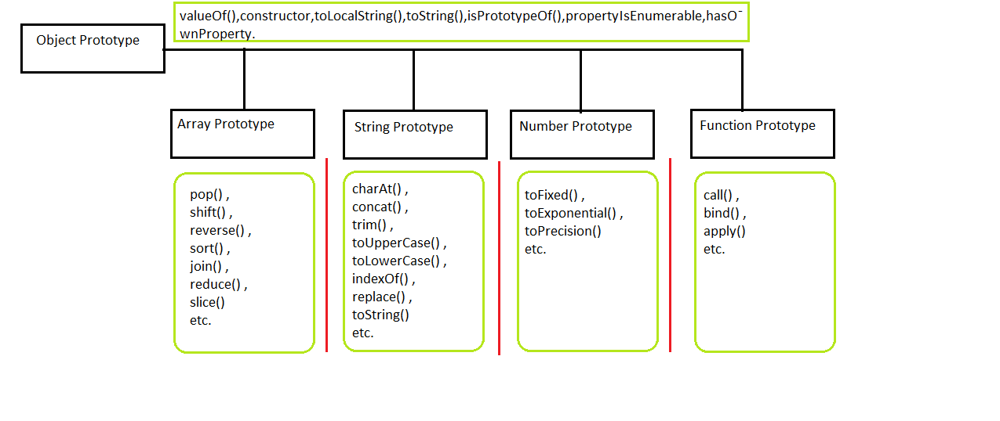
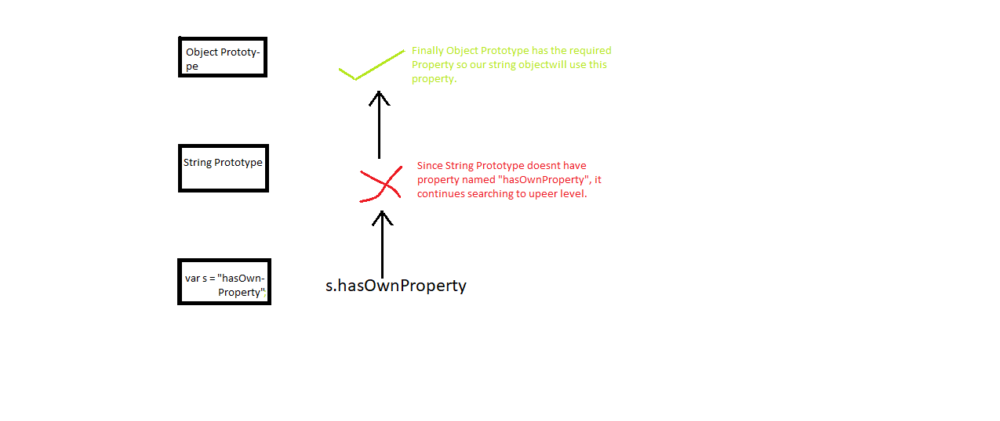
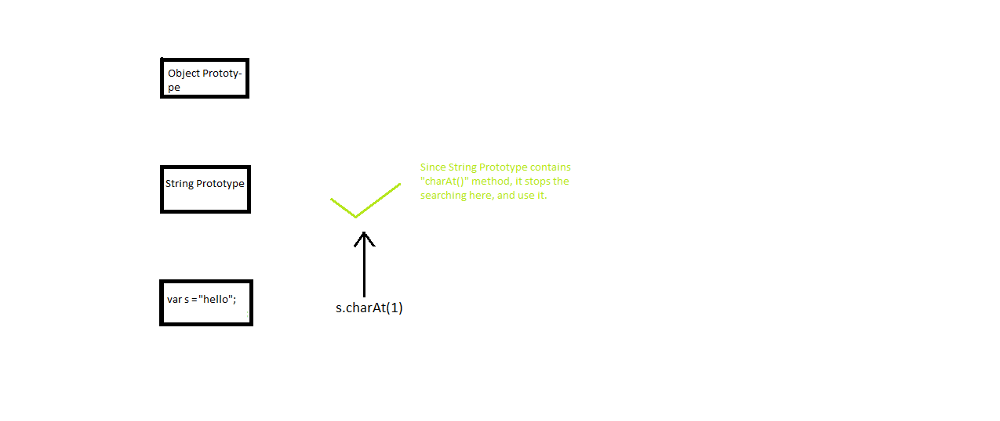

# Inheritance In Javascript 

## Important Terms:

### <span style="color:red;">1. Prototype : A Prototype is like a blueprint object for the object. </span>
> <span style="color:brown;font-size:1.5em">The object's Parent is called its prototype.</span>


___

## <span style="color:blue;font-size:1em">Inheritance:</span>

### **When a generic object is created its prototype passes it many important properties. Inheritance helps in avoiding over-coding multiple properties and methods into similar objects.**
> <span style="color:brown;font-size:1.5em">Passing down properties from prototype to child object is called inheritance</span>


### Even All the native js data structures inherits all of their properties and methods from their own prototype, and Object Prototype is present at highest level of hierarchy, that is, all other data structures inherits some hidden properties from Object prototype.



### All the object have some properties that are given to them as soon as they created, these are:

> <a name="valueOf"></a><span style="color:brown;font-size:1.5em">1. valueOf</span><br>
> <a name="constructor"></a><span style="color:brown;font-size:1.5em">2. constructor</span><br>
> <a name="toLocalString"></a><span style="color:brown;font-size:1.5em">3. toLocalString</span><br>
> <a name="toString"></a><span style="color:brown;font-size:1.5em">4. toString</span><br>
> <a name="isPrototypeOf"></a><span style="color:brown;font-size:1.5em">5. isPrototypeOf</span><br>
> <a name="propertyIsEnumerable"></a><span style="color:brown;font-size:1.5em">6. propertyIsEnumerable</span><br>
> <a name="hasOwnProperty"></a><span style="color:brown;font-size:1.5em">7. hasOwnProperty</span><br>

______

# <span style="color:blue;font-size:1em">Chaining:</span>

### lets say a string object is created and it calls **hasOwnProperty** then this object search this property first in String object  and if it fails to find there then it goes to Object prototype and search there and as soon its find the property it stops there.


#### Example1:



```javascript
var s = "CheckinghasOwnProperty";
console.log(s.hasOwnProperty());
```

    false
    

---
#### Example2:



```javascript
var s = "hello";
s.charAt(1);
```


    'e'


---

## Adding Inheritable Properties to Prototypes:

### We can add properties to prototypes so that it could be used by its child objects

### Example : Let say we want to add property "greetings" to String Prototype. we can do that as:


```javascript
String.prototype.greetings = function(){
                                return "Hello "+this+" !!" ; 
                            }
// testing
var s = "Vishal";
console.log(s.greetings())
```

    Hello Vishal !!
    

---

## <span style="color:blue;">Another way to build objects using</span> <span style="color:red;">Object.create()</span>

### Using inheritance, we can create new object with our existing Object as prototype.
Example:


```javascript
var parentObject = {a:1,b:2};
var childObject = Object.create(parentObject);

console.log("Parent Object : ",parentObject);
console.log("Child Object's a : ",childObject.a,", and b :",childObject.b);
```

    Parent Object :  { a: 1, b: 2 }
    Child Object's a :  1 , and b : 2
    

### We can add other properties to child objects too.


```javascript
childObject.c = 3;
```


    3


### To check whether a particular object is <span style="color:red;">ancestor or prototype </span> of another object, we can use  [isPrototypeOf](#isPrototypeOf)  property of Object.


```javascript
console.log(Object.prototype.isPrototypeOf(parentObject)) // or console.log(Object.isPrototypeOf(parentObject))
console.log(Object.prototype.isPrototypeOf(childObject))

console.log(parentObject.isPrototypeOf(childObject))
console.log(childObject.isPrototypeOf(parentObject))

console.log(parentObject.isPrototypeOf(Object))
console.log(childObject.isPrototypeOf(Object))
```

    true
    true
    true
    false
    false
    false
    

---
## <span style="color:blue;">Class :</span> 
> <span style="color:brown;font-size:1.5em">A Class is a set of objects that all share and inherit from the same basic prototype.</span>

## <span style="color:blue;">Constructor :</span> 
> <span style="color:brown;font-size:1.5em">A constructor allows us to setup inheritance while also assigning specific property values.</span>
>> <span style="color:green;font-size:1em">"Generally the name of constructor starts with capital letter"</span>

Example:


```javascript
function Xconstructor(a,b=1){          // here default value of b is 1.
    this.a = a;
    this.b = b;
}

//Now declaring prototype methods which will be same for all child objects:
Xconstructor.prototype = {
    printValues : function(){
                    console.log("Values are, a = ",this.a," and b = ",this.b);
                }
}
```


    { printValues: [Function: printValues] }


## <span style="color:blue;">new :</span> 
> <span style="color:brown;font-size:1.5em">"new" keyword produces a new object of class</span>
>> <span style="color:green;font-size:1em">It instantiates the class</span>


```javascript
var x1 = new Xconstructor(1)           // a=1,b=1(default)
var x2 = new Xconstructor(1,2)        //  a=1,b=2

x1.printValues()
```

    Values are, a =  1  and b =  1
    


```javascript
x2.printValues()
```

    Values are, a =  1  and b =  2
    

---

<span style="color:blue;font-size:1.5em">Overriding prototypal properties</span>

### lets override printValues funtion (above) for child objects.


```javascript
x1.printValues = function(){
    console.log("overriden method..");
}
```


    [Function]


```javascript
x1.printValues()            // here printValues() is overriden
```

    overriden method..
    


```javascript
x2.printValues()
```

    Values are, a =  1  and b =  2
    

#### lets override for all the other child objects.


```javascript
Xconstructor.prototype.printValues = function(){
    console.log("overriden again..")
}
```


    [Function]


```javascript
var x3 = new Xconstructor(3,4)
```


```javascript
x1.printValues()
x2.printValues()
x3.printValues()
```

    overriden method..
    overriden again..
    overriden again..
    

<hr/>
